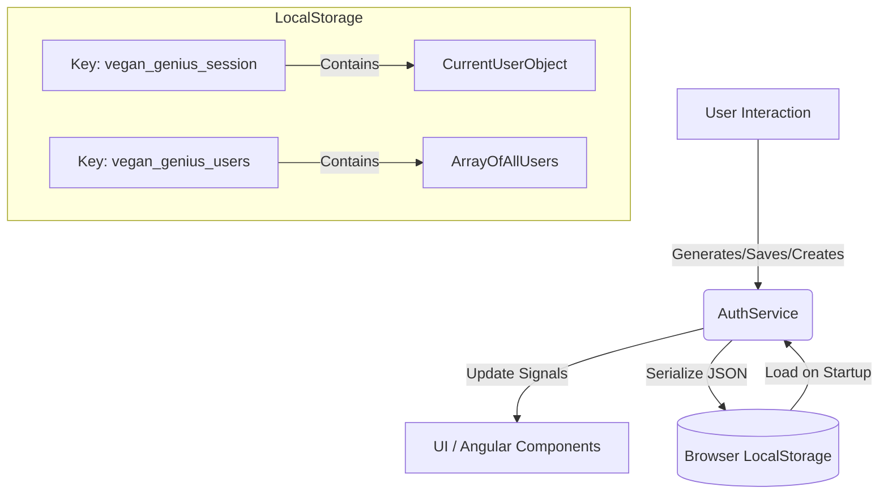

```mermaid
graph TD
    A[User Interaction] -->|Generates/Saves/Creates| B(AuthService)
    B -->|Update Signals| C[UI / Angular Components]
    B -->|Serialize JSON| D[(Browser LocalStorage)]
    
    subgraph LocalStorage
    D1[Key: vegan_genius_session] -->|Contains| CurrentUserObject
    D2[Key: vegan_genius_users] -->|Contains| ArrayOfAllUsers
    end
    
    D -->|Load on Startup| B

```