# CI/CD Process Chart

This process chart details the step-by-step sequence of operations within each CI/CD stage.

```mermaid
graph LR
    subgraph "Stage 1: Code Quality"
        direction TB
        S1A[1. Checkout code] --> S1B[2. Install uv]
        S1B --> S1C[3. Install Python 3.13]
        S1C --> S1D[4. uv sync --dev]
        S1D --> S1E[5. Black --check]
        S1E --> S1F[6. Flake8 lint]
    end

    subgraph "Stage 2: Type Safety"
        direction TB
        S2A[1. Checkout code] --> S2B[2. Install uv]
        S2B --> S2C[3. Install Python 3.13]
        S2C --> S2D[4. uv sync --dev]
        S2D --> S2E[5. mypy type check]
    end

    subgraph "Stage 3: Testing"
        direction TB
        S3A[1. Checkout code] --> S3B[2. Install uv]
        S3B --> S3C[3. Install Python 3.13]
        S3C --> S3D[4. uv sync --dev]
        S3D --> S3E[5. pytest + coverage]
        S3E --> S3F[6. Upload coverage.xml]
    end

    subgraph "Stage 4: Security"
        direction TB
        S4A[1. Checkout code] --> S4B[2. Install uv]
        S4B --> S4C[3. Install Python 3.13]
        S4C --> S4D[4. uv sync --dev]
        S4D --> S4E[5. pip install safety]
        S4E --> S4F[6. safety check]
    end

    subgraph "Stage 5: AI Review"
        direction TB
        S5A[1. Dispatch event] --> S5B[2. Mint app token]
        S5B --> S5C[3. Extract command]
        S5C --> S5D[4. Acknowledge request]
        S5D --> S5E[5. Route to handler]
        S5E --> S5F[6. Run Gemini CLI]
    end

    subgraph "Stage 6: Repo Hygiene"
        direction TB
        S6A[1. Checkout code] --> S6B[2. Set up Python]
        S6B --> S6C[3. Run filename checker]
        S6C --> S6D[4. Upload log artifact]
    end
```

## Process Stages Summary

| Stage | Name | Trigger | Tool | Purpose |
|-------|------|---------|------|---------|
| 1 | Code Quality | push/PR to main | Black, Flake8 | Enforce formatting and lint rules |
| 2 | Type Safety | push/PR to main | mypy | Catch type errors statically |
| 3 | Testing | push/PR to main | pytest | Validate functionality, measure coverage |
| 4 | Security | push/PR to main | Safety | Scan dependencies for known vulnerabilities |
| 5 | AI Review | PR opened, @gemini-cli | Gemini CLI | Automated code review and issue triage |
| 6 | Repo Hygiene | push/PR to any branch | Python script | Detect non-ASCII filenames |

## Environment Variables Required per Stage

| Stage | Variable | Purpose |
|-------|----------|---------|
| 3 | `FLASK_SECRET_KEY` | Flask session key for test app context |
| 3 | `GOOGLE_CLIENT_ID` | OAuth client ID for auth test mocking |
| 3 | `GOOGLE_CLIENT_SECRET` | OAuth client secret for auth test mocking |
| 5 | `GEMINI_API_KEY` / `GOOGLE_API_KEY` | Gemini AI API authentication |
| 5 | `APP_ID` + `APP_PRIVATE_KEY` | GitHub App token minting |
| 5 | `GOOGLE_CLOUD_*` vars | GCP Vertex AI authentication (optional) |
