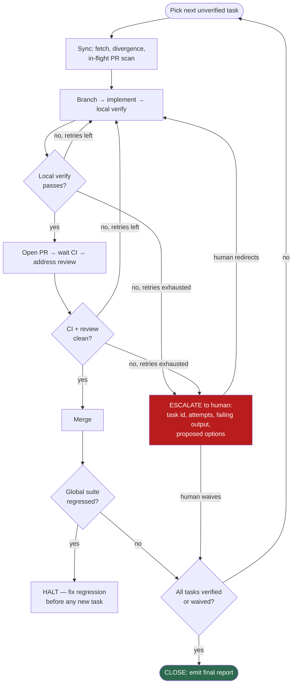

# PROMPT.md — Agent-Harness Goal: CI/CD Refresh

Drop-in goal definition for an agent-harness / bounded-loop run (e.g. the
`agent-harness` skill's goal compiler, or a `/loop`-style driver). It compiles into
verifiable tasks: every task has a machine-run verify, a retry cap, and an escalation
path. The loop must not close until every task is verified green or explicitly waived
by a human.

---

## Goal

Restore and harden CI/CD quality gates in `adamtasteslikegood/tasteslikegood.com`
(Backend repo) per `docs/ci/refresh/SPEC-01-ci-quality-gates.md` and
`SPEC-02-ai-triage-and-review.md`, executing the phases in
`docs/ci/refresh/TODO.md` in order.

## Operating constraints (hard rules)

1. Branch off `dev`, PR into `dev`. **Never** commit to `dev` or `main` directly.
   Branch names: `chore/ci-<topic>` or `fix/<topic>`.
2. One concern per PR, matching the TODO's PR boundaries. No omnibus PRs.
3. Sync before creating each branch — Dependabot and other agents are active in this
   repo, so stale bases and duplicate work are real risks. Concretely:
   `git fetch origin --prune`; branch from `origin/dev` (never the local `dev`);
   scan in-flight work with `gh pr list --state open` and
   `git branch -r --sort=-committerdate | head`; if an open PR already covers the
   task, build on it instead of duplicating.
4. Never lower a quality bar to force green: no blanket `# noqa`, no
   `--ignore-missing-imports` additions beyond what exists, no `pytest.mark.skip`,
   no deleting tests. Narrow, justified suppressions only — each needs a code comment
   stating why and, for deferrals, a tracking issue.
5. AI/Gemini workflow checks must never be added to required status checks.
6. Branch-protection changes (Phase 4) and any force-type operation → **escalate,
   human approves** before applying.
7. Own every PR you open until it merges: monitor checks and review comments
   (`gh pr checks <n>`, `gh pr view <n> --comments`,
   `gh api repos/{owner}/{repo}/pulls/<n>/comments`); for each piece of feedback,
   either push a fix and reply confirming what changed, or reply with a concrete
   technical rebuttal. A PR with unaddressed feedback or failing checks is not done.

## Global verification suite (run after every task; all must pass at close)

```bash
uv sync --dev
uv run black --check .
uv run flake8 . --count
uv run mypy . --ignore-missing-imports
FLASK_SECRET_KEY=x GOOGLE_CLIENT_ID=x GOOGLE_CLIENT_SECRET=x uv run pytest -q
actionlint .github/workflows/*.yml   # if actionlint unavailable: uvx --from actionlint-py actionlint
```

Baseline (2026-07-14) so the harness can detect regression vs progress:
black ❌ 15 files · flake8 ❌ 38 · mypy ❌ crash · pytest ❌ 4 failed/160 passed.

## Task plan

Execute strictly in order; each task = branch → change → local verify → PR → CI verify
→ merge (or escalate). `verify:` lines are machine-checkable and non-negotiable.

| # | Task | Verify (exit 0 / condition) | Retries |
|---|---|---|---|
| T1 | `ci.yml`: triggers → `[main, dev]`; add concurrency; swap safety→pip-audit | `actionlint`; scratch PR into `dev` shows Lint/Type-Check/Test/Security jobs running | 2 |
| T2 | Black sweep + `.git-blame-ignore-revs` | `uv run black --check .` | 1 |
| T3 | Flake8 to zero | `uv run flake8 . --count` prints `0`; diff contains no blanket ignores | 3 |
| T4 | mypy unbroken + errors resolved/tracked | `uv run mypy . --ignore-missing-imports` exits 0 | 3 |
| T5 | Root-cause 4 `test_public_ssr.py` failures; fix code or tests per the SSR contract | full pytest → `164 passed` | 3 |
| T6 | Docker build job in `ci.yml` | build job green on PR; red-test on scratch branch with broken `requirements.txt`, then reverted | 2 |
| T7 | Branch protection on `dev` + `main` (**escalate first**) | `gh api .../branches/dev/protection --jq '.required_status_checks.contexts'` returns exactly the contexts enumerated in SPEC-01 §4.3 (per-language `Analyze (...)` contexts, never a `CodeQL` workflow-name context) | 1 |
| T8 | Drain Dependabot queue (`@dependabot rebase`, merge through gates) | `gh pr list --state open --author app/dependabot` → each green-merged or closed with reason | 2/PR |
| T9 | Scheduled triage: 6h cron + failure→`ci-health` issue | green scheduled run; forced-failure test opens issue | 2 |
| T10 | Standalone `gemini-triage.yml` | test issue auto-labeled; `actionlint` clean | 2 |
| T11 | Standalone `gemini-review.yml` (label-gated, same-repo/non-Dependabot guard, `GEMINI_CLI_TRUST_WORKSPACE=true`) | labeled internal PR gets review; labeled Dependabot PR skips cleanly; check absent from required contexts | 2 |
| T12 | Standalone `gemini-invoke.yml` (association allowlist enforced outside the model on trigger AND `/approve` comments; `GEMINI_CLI_TRUST_WORKSPACE=true`) | collaborator trigger + approval acted on; outsider trigger ignored; outsider `/approve` leaves run halted | 2 |
| T13 | Docs close-out: audit addendum, CLAUDE.md commands, cookbook submodule bump PR | files updated; cookbook PR open | 1 |

## Loop protocol



- **Retry cap:** per-task caps above. A retry must change approach, not re-run the
  same failing attempt.
- **Escalate, don't improvise,** when: retries exhausted; a fix requires design
  judgment (e.g. T5 turns out to be a real SSR regression — file it, escalate);
  anything touches branch protection, secrets, or repo settings (T7 always escalates
  before applying); or an in-flight PR by someone else overlaps the task.
- **Budget:** if wall-clock or token budget exhausts mid-phase, stop at the last merged
  task, write a state file (`docs/ci/refresh/HARNESS-STATE.md`) with per-task status
  (`verified / in-progress / blocked / waived + evidence`), and report.
- **Close condition:** every task verified or human-waived **and** the global
  verification suite passes on `dev` **and** no PR opened by this run has unaddressed
  review comments. Emit a final report: per-task evidence (commands + exit codes),
  merged PR list, escalations and their resolutions.
