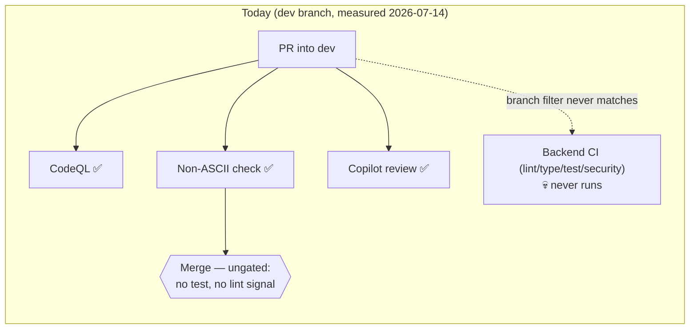
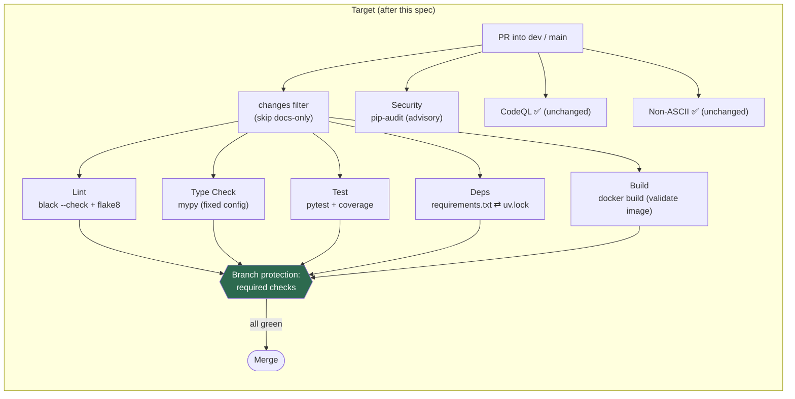
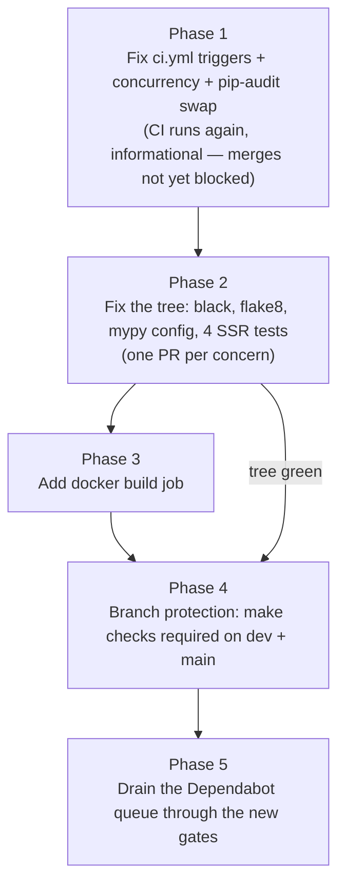

# SPEC-01 — CI Quality Gates Refresh

**Repository:** `adamtasteslikegood/tasteslikegood.com` (Backend submodule of the cookbook repo)
**Status:** Proposal
**Date:** 2026-07-14
**Companion docs:** [SPEC-02 AI triage & review](SPEC-02-ai-triage-and-review.md) · [TODO](TODO.md) · [PROMPT.md](PROMPT.md) · [April 2026 audit](../CI-AUDIT-REPORT.md)

---

## 1. Problem statement

The Backend repo once had a full CI gate suite — Black, Flake8, mypy, pytest with
coverage, a requirements/uv.lock sync check, and an AI triage/review pipeline. Most of
it has silently died:

1. **`ci.yml` never runs.** Its triggers are `push`/`pull_request` on
   `[main, dev/backend_sub222, develop]`. The repo's integration branch has been `dev`
   since the branching strategy was finalized — none of those filters match, so the
   Lint/Type-Check/Test/Security jobs have not executed on any recent PR. The workflow
   shows "active" in the Actions UI, which hides the problem.
2. **The Gemini dispatch pipeline was deleted** (commit `9ef54fc`, 2026-07-04) after
   failing on every PR event since April. Only the independent hourly
   `gemini-scheduled-triage.yml` survives (green). See SPEC-02.
3. **The tree has rotted without gates.** Measured on `dev` @ 2026-07-14:

   | Check | Command | Result |
   |---|---|---|
   | Format | `uv run black --check .` | ❌ 15 files would be reformatted (234 clean) |
   | Lint | `uv run flake8 . --count` | ❌ 38 violations |
   | Types | `uv run mypy . --ignore-missing-imports` | ❌ hard error — `scripts/backfill_slugs.py` duplicate-module/package-bases failure aborts the run; **nothing is checked** |
   | Tests | `uv run pytest` | ❌ 4 failed / 160 passed — all in `tests/test_public_ssr.py` (canonical-link + sitemap assertions) |

4. **Nothing gates merges.** Ten Dependabot PRs are open right now with only CodeQL
   and the non-ASCII filename check running against them. Auto-merge
   (`dependabot-auto-merge.yml`) approves without any test signal.

What still works: CodeQL (`codeql.yml` + default setup), `check-non-ascii-filenames.yml`,
`dependabot-auto-merge.yml` (mechanically), Dependabot updates, and Copilot review.

## 2. Goals

- Every PR into `dev` (and `main`) runs format, lint, type-check, test, and
  requirements-sync gates — and those gates are **required** to merge.
- The current tree passes all gates (fix the rot, don't lower the bar arbitrarily).
- The Docker image build is validated in CI so a broken `requirements.txt` or
  Dockerfile is caught before the cookbook repo's release-tag deploy.
- Failures are loud: a dead workflow must fail visibly, not skip silently.

### Non-goals

- Production deploy pipelines. Deploys are owned by the **cookbook repo's**
  `cloudbuild.yaml` (tag-push trigger → build → migrate Job → deploy). This spec adds a
  *build validation* gate here, not a deploy.
- Resurrecting the 4-workflow Gemini dispatch machine (SPEC-02 proposes a smaller
  replacement).
- Frontend checks (Prettier/ESLint/Vitest live in the cookbook repo and are healthy).

## 3. Current vs target pipeline





## 4. Design

### 4.1 `ci.yml` — fix triggers, keep the good bones

The existing job structure (uv-based, Python 3.13, cache enabled) is sound; the
April audit already killed its pip-based duplicate. Changes:

```yaml
on:
  push:
    branches: [main, dev]
  pull_request:
    branches: [main, dev]
concurrency:
  group: ci-${{ github.workflow }}-${{ github.ref }}
  cancel-in-progress: true
```

- **Keep** the four jobs (lint, type-check, test, security) and the
  `requirements.txt ⇄ uv.lock` diff step — that check exists because a Dependabot bump
  once shipped a broken `requirements.txt` and killed the v0.3.0 deploy in the migrate
  Job. It stays.
- **Add `concurrency`** so force-pushes don't stack runs.
- **Add a `build` job**: `docker build -f Dockerfile .` (no push). The Dockerfile
  installs from `requirements.txt`, so this catches image-level breakage that
  `uv sync` cannot.
- **Replace `safety check`** (deprecated CLI, `|| true` today — pure noise) with
  `pip-audit`, still `continue-on-error: true` initially. Promote to blocking only
  after a clean week.
- Optional but cheap: a `docs-only` paths filter so markdown-only PRs skip the heavy
  jobs while still reporting required-check success (use
  `paths-ignore` + a no-op success job, or `dorny/paths-filter`).

### 4.2 Fix the tree (make the gates pass honestly)

| Fix | Scope | Notes |
|---|---|---|
| `black .` | 15 files | Mechanical; single commit so `git blame` stays usable |
| flake8 | 38 violations | Fix real issues; only add targeted `# noqa` / per-file-ignores for false positives. Ensure `.flake8`/config matches Black (`max-line-length = 100`, `extend-ignore = E203,W503`) |
| mypy crash | `scripts/backfill_slugs.py` | Add `explicit_package_bases = true` or exclude `scripts/` in `[tool.mypy]`; then fix whatever real errors surface once mypy actually runs |
| pytest | 4 failures in `tests/test_public_ssr.py` | Canonical-link/sitemap assertions — likely drifted template vs test expectations. Investigate root cause; fix code or tests to match the SSR contract, don't skip |

### 4.3 Branch protection (the actual gate)

After the tree is green, configure on **`dev`** and **`main`** (repo Settings →
Branches, or `gh api`):

- Required status checks: `Lint (Black + Flake8)`, `Type Check (mypy)`,
  `Test (pytest)`, `Build (docker)`, `Check for Non-ASCII Characters in Filenames`,
  `CodeQL`.
- Require branches to be up to date before merging: **off** (Dependabot volume makes
  this painful; the merge queue can come later if needed).
- Dependabot auto-merge then only fires when required checks pass — restoring the
  safety it currently only pretends to have.

The April audit recommended exactly this and it was never done; it is the single
highest-leverage step in this spec.

### 4.4 Rollout order (safety)



Phase 1 before Phase 2 is deliberate: turning CI on first gives every subsequent fix
PR a real red/green signal, and the intermediate failures are visible instead of
hidden. Branch protection waits until the tree is green so we never block merges on
pre-existing rot.

## 5. Acceptance criteria

1. A trivial PR into `dev` shows Lint/Type-Check/Test/Deps/Build checks running.
2. `uv run black --check . && uv run flake8 . --count && uv run mypy . && uv run pytest`
   all exit 0 on `dev`.
3. `gh api repos/{owner}/{repo}/branches/dev/protection` lists the five required checks.
4. A PR that deliberately breaks a test cannot be merged (verified once, then reverted).
5. Dependabot PRs merge only after required checks pass.

## 6. Risks

| Risk | Mitigation |
|---|---|
| Dependabot PRs (10 open) conflict with the format/lint sweep | Land the sweep first; rebase/recreate Dependabot PRs (`@dependabot rebase`) |
| mypy surfaces a large error backlog once it stops crashing | Time-box: fix cheap errors, add explicit `# type: ignore[code]` with tracking issue for the rest; never leave mypy crashing |
| SSR test failures are a real prod bug, not test drift | Investigate before "fixing the test" — if the canonical tags are genuinely missing in prod, that's an SEO bug worth its own fix PR |
| Required checks block urgent fixes | Repo admins can bypass; keep the bypass audited |
