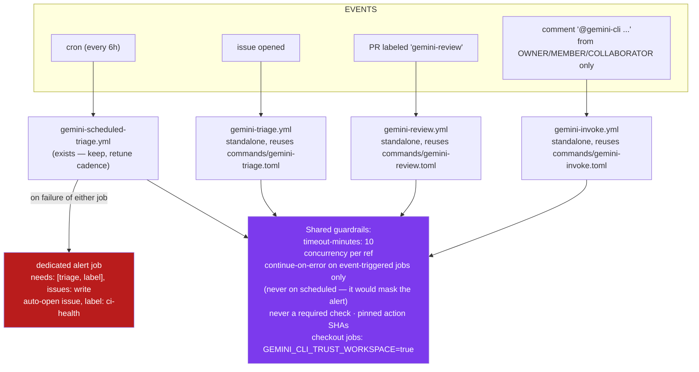

# SPEC-02 — AI Triage & Review Workflows Refresh

**Repository:** `adamtasteslikegood/tasteslikegood.com`
**Status:** Proposal
**Date:** 2026-07-14
**Depends on:** [SPEC-01](SPEC-01-ci-quality-gates.md) (core gates come first)

---

## 1. History — what died and why

The repo ran a four-workflow Gemini pipeline:

| Workflow | Role | Fate |
|---|---|---|
| `gemini-dispatch.yml` | Entry point — listened to PR/issue/comment events, routed to the three below via `workflow_call` | Deleted `9ef54fc` (2026-07-04): **failed on every PR/issue event from April to July**. Three parallel fix attempts (#122/#123/#124) all stalled |
| `gemini-invoke.yml` | `@gemini-cli` on-demand agent | Deleted (unreachable without dispatch) |
| `gemini-review.yml` | PR code review | Deleted (unreachable without dispatch) |
| `gemini-triage.yml` | Issue labeling on open | Deleted (unreachable without dispatch) |
| `gemini-scheduled-triage.yml` | Hourly cron: triages **all** unlabeled issues in batch | **Alive and green** — kept |

The command definitions in `.github/commands/gemini-*.toml` were left in place, so the
prompt/tooling content of the old pipeline is preserved and reusable.

Structural lessons from the failure:

1. **The dispatch hub was a single point of failure.** One broken router took all four
   functions down, and because callees were `workflow_call`-only, nothing could run
   standalone.
2. **It ran on every event with no off-switch**, so its failure spammed every PR with a
   red ❌, training everyone to ignore CI status — corrosive to the real gates.
3. **Nobody was alerted** that it had been failing for two months. Red checks on merged
   PRs were normalized.

## 2. Goals

- Restore the two AI functions that earned their keep: **issue triage** (scheduled one
  already works) and **on-demand PR review/agent invocation**.
- No component may ever again fail on every PR: AI workflows must be **opt-in per
  event** and **non-blocking** (`continue-on-error` at job level, never a required
  check).
- A silently-failing scheduled workflow must page someone (issue creation on failure).

### Non-goals

- Making AI review a merge gate. Copilot review already runs on PRs; Gemini review is
  additive advisory signal.
- Rebuilding the dispatch hub. Standalone workflows only.

## 3. Design

Key choices, mapped to the failure lessons:

1. **Standalone workflows, no router.** Each `.yml` owns its own trigger. One breaking
   leaves the others running.
2. **Opt-in triggers.** Review runs only when a human applies the `gemini-review`
   label (or on `workflow_dispatch`). Invoke runs only on `@gemini-cli` comments from
   users with `OWNER`/`MEMBER`/`COLLABORATOR` association — this is also the prompt-
   injection guard: never execute instructions from untrusted comment bodies.
3. **Failure hygiene.** Every workflow: `timeout-minutes` and a `concurrency` group.
   Job-level `continue-on-error: true` applies to the **event-triggered** workflows
   only (triage/review/invoke), where its purpose is to keep AI failures from
   reddening PRs and issues. The **scheduled** workflow must NOT use it: job-level
   `continue-on-error` reports the job as succeeded, so a `needs`-based alert with
   `if: failure()` would never fire — the exact silent-failure mode this spec exists
   to prevent. Scheduled runs fail loudly instead (they annotate no PR, so there is
   no cost) and get alerting that opens/updates a `ci-health` issue. Note the
   workflow has **two jobs** (`triage`, which only has `issues: read`, and `label`,
   which has `issues: write`) — a failure step inside one job cannot see the other's
   result. Implement alerting as a **dedicated final job**: `needs: [triage, label]`,
   `if: failure()`, with its own `issues: write` permission, so a failure in either
   stage raises the alarm and issue creation is never denied.
4. **Retune the cron.** Hourly (24 runs/day) is over-provisioned for current issue
   volume — the April audit flagged this. Move to every 6 hours.
5. **Secrets/auth**: reuse whatever `gemini-scheduled-triage.yml` uses today
   (`GEMINI_API_KEY` / Vertex WIF) — it is the working reference implementation.
   Pin `google-github-actions/run-gemini-cli` to a commit SHA. Auth alone is not
   sufficient for the restored jobs: any job that **checks out the repo**
   (review, invoke) must also set `GEMINI_CLI_TRUST_WORKSPACE: true` — the headless
   CLI refuses to operate on an untrusted checkout (job 86047077397 on 2026-07-09
   exited before doing any work for exactly this reason).

   > **Correction (2026-07-14, found during rollout):** the trust requirement has
   > widened — current gemini-cli refuses to run in an untrusted directory on
   > **every** invocation, even with no checkout at all (run 29353718769 failed in
   > an empty workspace). Set `GEMINI_CLI_TRUST_WORKSPACE: 'true'` on *every*
   > `run-gemini-cli` job. The scheduled triage's historical green runs were no
   > counter-evidence: its Gemini step skips whenever there are no untriaged
   > issues, so those runs never exercised the CLI (fixed alongside the standalone
   > triage in #183).
6. **Event model for review** (secrets vs forks): `gemini-review.yml` triggers on
   `pull_request` with `types: [labeled]` plus a guard that the head repo is this
   repo and the actor is not `dependabot[bot]`. Dependabot- and fork-triggered
   `pull_request` runs receive **no repository secrets and a read-only token**, so
   Gemini auth is structurally impossible there — the job must skip cleanly instead
   of failing. Do **not** reach for `pull_request_target` to work around this: it
   hands secrets to workflows on PR events, and is acceptable only if the workflow
   never checks out or executes the PR head. Internal (same-repo, human) PRs are the
   actual use case; validate there.
7. **Deterministic approval gate for invoke**: the reused
   `.github/commands/gemini-invoke.toml` posts a plan and then has the *model* poll
   comments for `/approve` before using write-capable tools. A model-enforced check
   is not a security boundary — an outsider's `/approve` could green-light a run a
   collaborator initiated. The workflow/tooling layer must verify **outside the
   model** that any `/approve` comment author has `author_association` in
   OWNER/MEMBER/COLLABORATOR (e.g. the approval-polling step filters comments by
   association before the model ever sees them, or a gate step re-validates before
   write tools unlock). Ship with a negative test.

## 4. Rollout

1. Retune + alerting on `gemini-scheduled-triage.yml` (lowest risk, already green).
2. Add standalone `gemini-triage.yml` (issue-opened). Validate on a test issue.
3. Add `gemini-review.yml` (label-triggered, event model per §3.6). Validate on an
   **internal test PR** — not a Dependabot PR, which receives no secrets and must
   skip cleanly rather than fail.
4. Add `gemini-invoke.yml` (comment-triggered) **last** — it has the largest injection
   surface; ship only with the association allowlist verified on both the trigger
   comment **and** the `/approve` approval comment (§3.7).

Each step is its own PR; a step that misbehaves gets reverted without touching the
others.

## 5. Acceptance criteria

1. `gh run list --workflow=gemini-scheduled-triage.yml` shows green runs at the 6-hour
   cadence, and a forced failure (temporarily bad API key on a test branch) opens a
   `ci-health` issue.
2. Opening an issue gets it labeled within one run of `gemini-triage.yml`.
3. Applying `gemini-review` to an **internal** PR produces review comments; applying
   it to a Dependabot or fork PR skips cleanly (no red check, no auth failure);
   **no** Gemini check ever appears in branch-protection required checks.
4. An `@gemini-cli` trigger comment from a non-collaborator does nothing, **and** a
   `/approve` comment from a non-collaborator on a pending invoke plan is ignored —
   the run stays halted (verify both with a test account or association simulation).
5. Two weeks post-rollout: zero PRs show a failing Gemini check.
