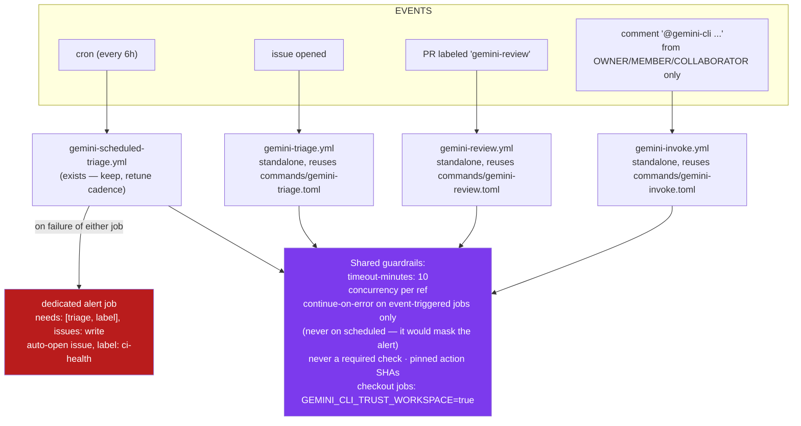

# AI Workflows — Gemini triage / review / invoke (standalone, non-blocking)

Mermaid source for [diagram-ai-workflows.svg](diagram-ai-workflows.svg).
Canonical context: [SPEC-02-ai-triage-and-review.md](SPEC-02-ai-triage-and-review.md).

