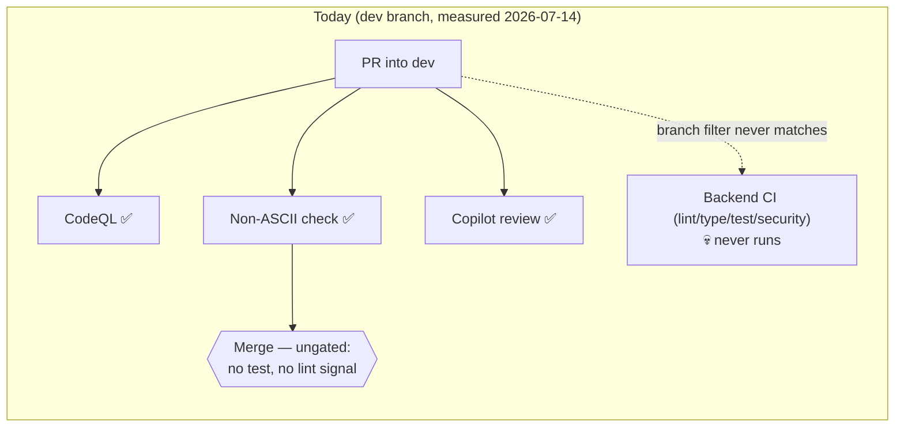

# Current State — CI on `dev` (measured 2026-07-14)

Mermaid source for [diagram-current-state.svg](diagram-current-state.svg).
Canonical context: [SPEC-01-ci-quality-gates.md](SPEC-01-ci-quality-gates.md).

