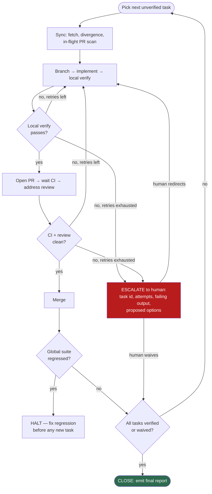

# Harness Loop — bounded agent loop for the CI/CD refresh

Mermaid source for [diagram-harness-loop.svg](diagram-harness-loop.svg).
Canonical context: [PROMPT.md](PROMPT.md).

```mermaid
flowchart TD
    START([Pick next unverified task]) --> SYNC["Sync: fetch, divergence,<br/>in-flight PR scan"]
    SYNC --> WORK["Branch → implement → local verify"]
    WORK --> V{Local verify<br/>passes?}
    V -->|no, retries left| WORK
    V -->|no, retries exhausted| ESC
    V -->|yes| PR["Open PR → wait CI → address review"]
    PR --> CIV{CI + review<br/>clean?}
    CIV -->|no, retries left| WORK
    CIV -->|no, retries exhausted| ESC["ESCALATE to human:<br/>task id, attempts, failing output,<br/>proposed options"]
    CIV -->|yes| MERGE["Merge"]
    MERGE --> REG{Global suite<br/>regressed?}
    REG -->|yes| HALT["HALT — fix regression<br/>before any new task"]
    REG -->|no| NEXT{All tasks verified<br/>or waived?}
    NEXT -->|no| START
    NEXT -->|yes| CLOSE([CLOSE: emit final report])
    ESC -->|human waives| NEXT
    ESC -->|human redirects| WORK
    style ESC fill:#b91c1c,color:#fff
    style CLOSE fill:#2d6a4f,color:#fff
```
