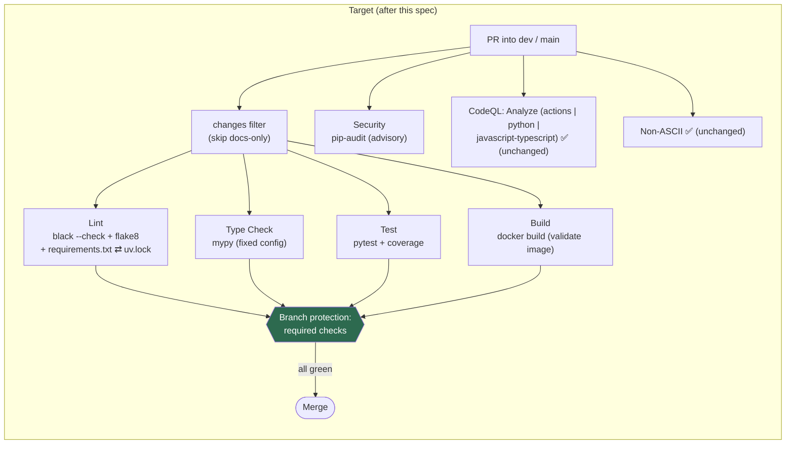

# Target Pipeline — CI after SPEC-01

Mermaid source for [diagram-target-pipeline.svg](diagram-target-pipeline.svg).
Canonical context: [SPEC-01-ci-quality-gates.md](SPEC-01-ci-quality-gates.md).

```mermaid
flowchart LR
    subgraph TARGET["Target (after this spec)"]
        direction TB
        PR2[PR into dev / main] --> T0["changes filter<br/>(skip docs-only)"]
        T0 --> T1["Lint<br/>black --check + flake8<br/>+ requirements.txt ⇄ uv.lock"]
        T0 --> T2["Type Check<br/>mypy (fixed config)"]
        T0 --> T3["Test<br/>pytest + coverage"]
        T0 --> T5["Build<br/>docker build (validate image)"]
        PR2 --> T6["Security<br/>pip-audit (advisory)"]
        PR2 --> T7["CodeQL: Analyze (actions | python |<br/>javascript-typescript) ✅ (unchanged)"]
        PR2 --> T8["Non-ASCII ✅ (unchanged)"]
        T1 & T2 & T3 & T5 --> G{{"Branch protection:<br/>required checks"}}
        G -->|all green| MERGE([Merge])
    end
    style G fill:#2d6a4f,color:#fff
```
